# Project: SMART FARM <br>

**Date:** 2024-12-16 <br>
**Author:** Hyeongyu Seo, Joungbin Choi, Chankuen Lee <br>
**Github:** https://github.com/shg0873/Embeded-Controller <br>
**Demo Video:**  https://youtu.be/Pgcpq7QTzDw <br>
**PDF version**: [PDF](SMART_FARM.pdf) <br>


___
## Contents
[Introduction](#Introduction) <br>
[Requirement](#Requirement) <br><br>
[1. Problem1](#problem-1-auto--manual-mode-based-on-bluetooth-comunication-br)<br>
[1-1. Procedure](#1-1-procedure-br) <br>
[1-2. Configuration](#1-2-Configuration-br) <br>
[1-3. Circuit Diagram](#1-3-Circuit-Diagram-br) <br>
[1-4. Common functions](#1-4-Common-functions-br) <br>
[1-5. Communication Controller](#1-5-Communication-Controller-br) <br>
[1-6. Main Control](#1-6-Main-Control) <br>
[1-7. Discussion](#1-7-Discussion-br) <br>
[1-8. Code](#1-8-Code-br) <br>
[1-9. Results](#1-9-Results-br) <br><br>
[2. Problem2](#problem-2-arduino-display--main-pump-main-led-br)<br>
[2-1. Library](#2-1-library-br) <br>
[2-2. Procedure](#2-2-procedure-br) <br>
[2-3. Configuration](#2-3-Configuration-br) <br>
[2-4. Circuit Diagram](#2-4-Circuit-Diagram-br) <br>
[2-5. Discussion](#2-5-Discussion-br) <br>
[2-6. Code](#2-6-Code-br) <br>
[2-7. Results](#2-7-Results-br) <br>
___
## Introduction
In retent days, a mart farm is uprising issue beacause of globarl warming and acute food insecurity.<br>
Our project is about hydroponic smart farm which is the technique to grow plants using a water-based solution rather than soil.<br>
In Handong Global University, there is a smart farm club that is using hydrponics technique. We will porvide embedded system to them, so that they can work on smart farm more efficeintly and automatically.

<p align="center">
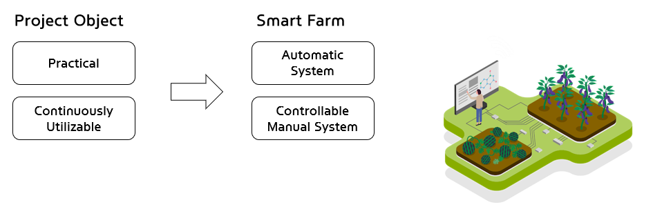 
<p align="center">

<p align="center">
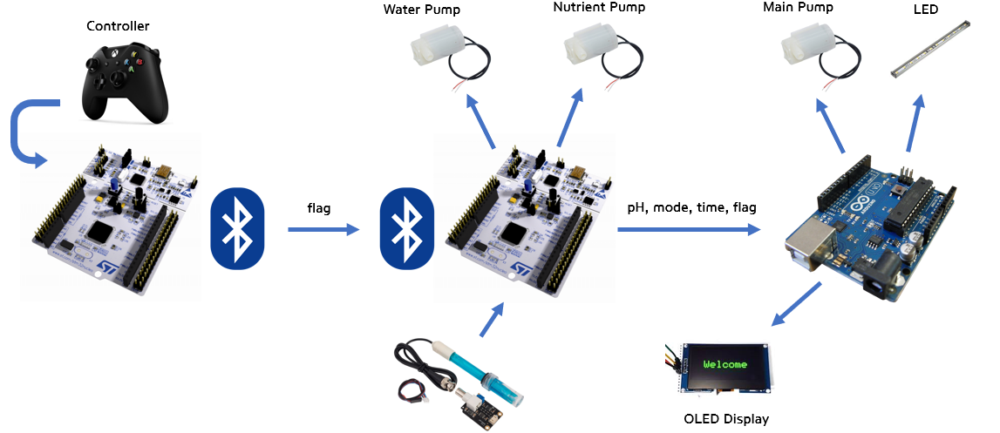 
<p align="center">

___
## Requirement
**Hardware** <br>

| **Item**      | **Mode/Description**                                                     | **Qty** |
|---------------|--------------------------------------------------------------------------|---------|
| MCU           | NUCLEO-F411RE                                                            | 2       |
| MCU           | Arduino UNO                                                              | 1       |
| Analog Sensor | Arduino Analog pH sensor (SEM0161)                                       | 1       | 
| Display       | [SMG] Arduino 2.42 Inch I2C OLED White                                   | 1       |
| Actuator      | Water Pump (5V)                                                          | 3       |
| Motor Driver  | DC motor driver (L9110s)                                                 | 2       |
| LED           | LED Bar 50cm (12V)                                                       | 1       |
| Communication | Bluetooth Module(HC-06)                                                  | 2       |
| Others        | 24V Battery, Voltage Regulator, Mosfet, Buttons, Breadboards, Water tank |         |


**Software** <br>
* Keil uVision, Arduino library, EC_HAL library <br>

___

## Problem 1: AUTO & Manual Mode based on bluetooth comunication <br>

The `communication_controller.c` file converts button inputs into corresponding flags as `uint8_t` values and transmits them via Bluetooth. The `main.c` file operates based on the received flags from Bluetooth, adjusting the system's behavior accordingly and send data to arduino board.

It also explains the mode transitions between manual and auto modes in the `communication_controller.c` and `main.c` files.

The header file is composed of
- common setup functions that apply to both files
- functions for data transmission via Bluetooth
- functions applied to the main MCU to control outputs based on received data

<p align="center">
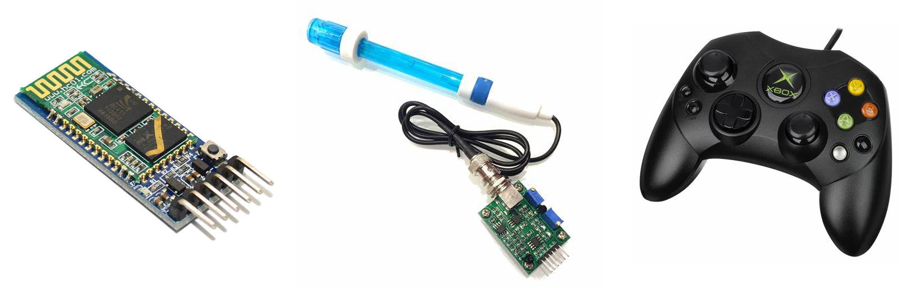 
<p align="center">

### 1-1. Procedure <br>
Following figure is block diagram of communication & mode change procedure <br>
<p align="center">
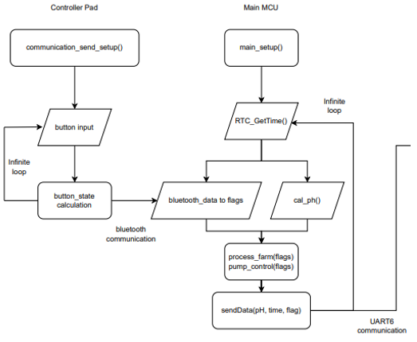 
<p align="center">

___

### 1-2. Configuration <br>

| Functions          | Register | PORT_PIN                  | Configuration                                        |
| ------------------ | -------- | ------------------------- | ---------------------------------------------------- |
| Bluetooth          | UART1    | TXD: PA_9<br />RXD: PA_10 | No Parity, 8-bit Data, 1-bit Stop bit 9600 baud-rate |
| System Clock       | RCC      |                           | PLL 84MHz                                            |
| LED toggle         | GPIO     | PA_1                      |                                                      |
| Motor PWM          | PWM      | PA_15, PB_3               | TIM2_CH1 & CH2,_20ms period                          |
| JADC               | JADC     | PA_0                      | TIM3, 1msec, RISE edge, priority 1                   |
| Wire Communication | UART6    | PB_12                     | No Parity, 8 bit each, 1-bit Stop bit 9600 baud-rate |


### 1-3. Circuit Diagram <br>

* **Water pump & pH sensor circuit**<br>
<p align="center">
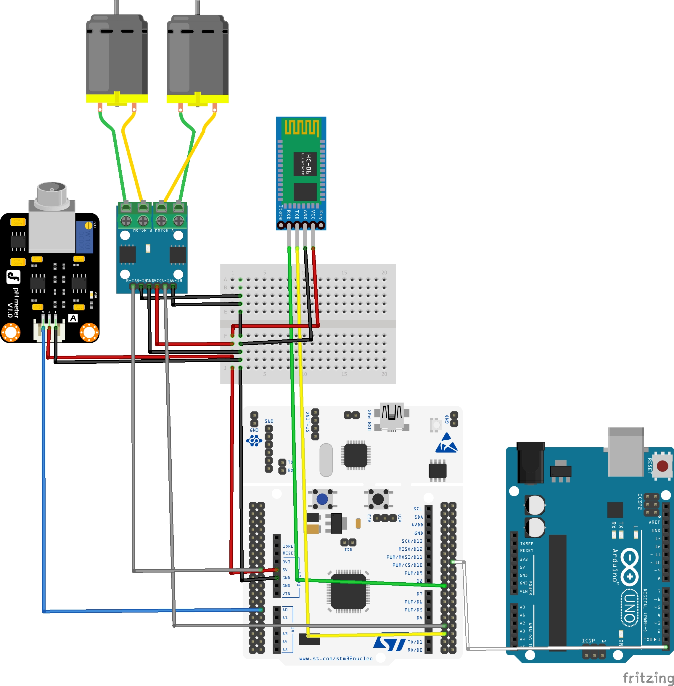 
<p align="center">

* * **Controller** <br>
<p align="center">
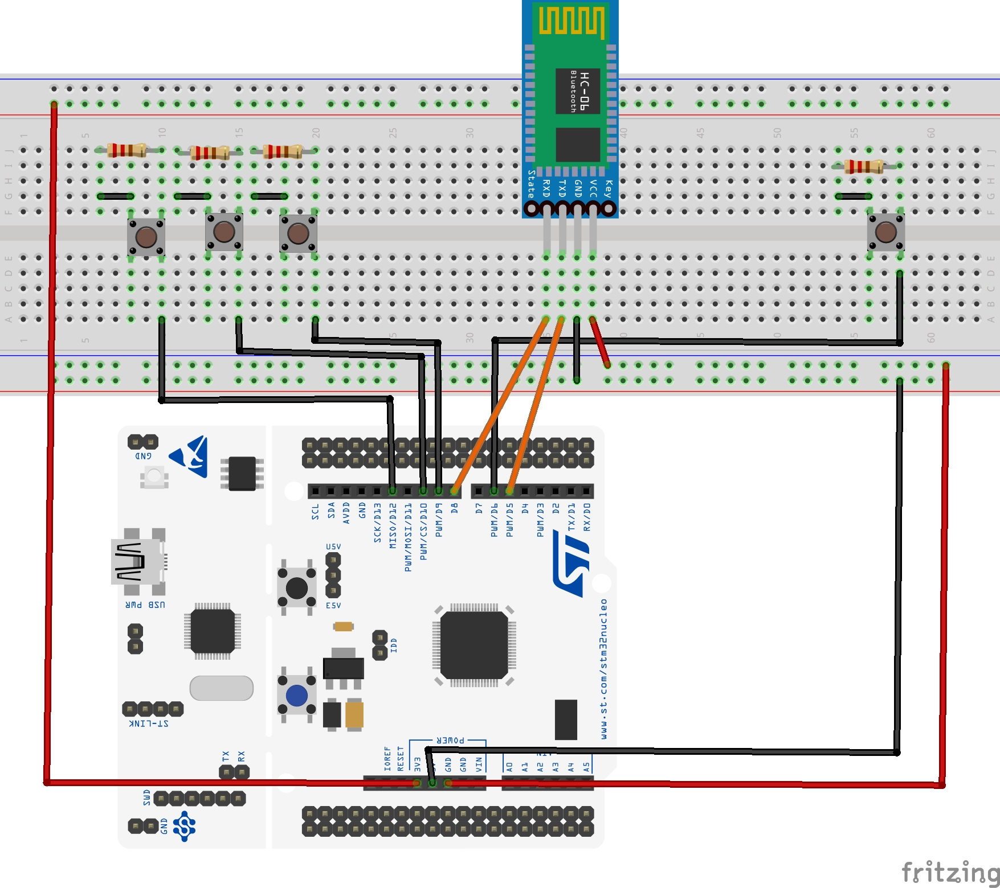 
<p align="center">

___
### 1-4. Common functions <br>
* **LED\_setup**
  - **Input Parameters:** None
  - **Role:** Initializes the LED pin.
  - **Code Structure:**
      ```c
      void LED_setup() {
          GPIO_init(LED_PIN, OUTPUT);
          GPIO_otype(LED_PIN, PushPull);
          GPIO_pupd(LED_PIN, PU);
          GPIO_ospeed(LED_PIN, Medium);
      }
      ```

* **UART1\_setup**
  - **Input Parameters:** None
  - **Role:** Initializes UART1 with a baud rate of 9600.
  - **Code Structure:**
      ```c
      void UART1_setup() {
          UART1_init();
          UART1_baud(BAUD_9600);
      }
      ```

* **UART6\_setup**
  - **Input Parameters:** None
  - **Role:** Initializes UART6 with a baud rate of 9600.
  - **Code Structure:**
      ```c
      void UART6_setup() {
          UART6_init();
          UART6_baud(BAUD_9600);
      }
      ```
___

### 1-5. Communication Controller <br>
* **communication\_send\_setup**
  - **Input Parameters:** None
  - **Role:** Sets up the communication send process.
  - **Code Structure:**
      ```c
      void communication_send_setup() {
          RCC_PLL_init();
          SysTick_init();
          LED_setup();
          communication_send_init();
          UART1_setup();
      }
      ```

* **communication\_send\_init**
  - **Input Parameters:** None
  - **Role:** Initializes the communication send pins.
  - **Code Structure:**
      ```c
      void communication_send_init() {
          pin[0] = COMMUNICATION_SEND_PINA;
          pin[1] = COMMUNICATION_SEND_PINB;
          pin[2] = COMMUNICATION_SEND_PINC;
          pin[3] = COMMUNICATION_SEND_PIND;

          for(int i = 0; i < PIN_INDEX; i++) {
              GPIO_init(pin[i], INPUT);
              GPIO_pupd(pin[i], PD);
          }
          GPIO_init(LED_PIN, OUTPUT);
          GPIO_otype(LED_PIN, PushPull);
          GPIO_pupd(LED_PIN, PD);
          GPIO_ospeed(LED_PIN, Medium);
      }
      ```

* **process\_button\_states**
  - **Input Parameters:** `uint8_t *button_state_current`, `uint8_t *button_state_history`
  - **Role:** Processes the button states and sends data via UART1.
  - **Code Structure:**
      ```c
      void process_button_states(uint8_t *button_state_current, uint8_t *button_state_history) {
          *button_state_current = 0;
          for (int i = 0; i < 4; i++) {
              *button_state_current |= (GPIO_read(pin[i]) == HIGH) << i;
          }
          uint8_t changed_buttons = *button_state_current ^ *button_state_history;
          *button_state_history = *button_state_current;

          if (changed_buttons) {
              USART1_write(button_state_current, sizeof(*button_state_current));
              if (*button_state_current) {
                  GPIO_write(LED_PIN, HIGH);
              } else {
                  GPIO_write(LED_PIN, LOW);
              }
          }
      }
      ```
  
___

### 1-6. Main Control

* **main\_setup**
  - **Input Parameters:** None
  - **Role:** Sets up the main control process.
  - **Code Structure:**
      ```c
      void main_setup() {
          RCC_PLL_init();
          SysTick_init();
          communication_recieve_setup();
          RTC_setup();
          pump_setup();
          ph_sensor_setup();
      }
      ```

* **RTC\_setup**
  - **Input Parameters:** None
  - **Role:** Initializes the RTC and sets the time and date. Need to set the program start time
  - **Code Structure:**
      ```c
      void RTC_setup() {
          RTC_Init();
          RTC_SetTime(16, 23, 00);
          RTC_SetDate(24, 12, 06, 5);
      }
      ```

* **communication\_recieve\_setup**
  - **Input Parameters:** None
  - **Role:** Sets up the communication receive process.
  - **Code Structure:**
      ```c
      void communication_recieve_setup() {
          LED_setup();
          UART1_setup();
          UART6_setup();
          UART1_baud(9600);
          UART6_baud(9600);
      }
      ```

* **pump\_setup**
  - **Input Parameters:** None
  - **Role:** Sets up the pump control using PWM.
  - **Code Structure:**
      ```c
      void pump_setup() {
          PWM_init(WATER_SUPPLY_PIN);
          PWM_init(NUTRIENT_SUPPLY_PIN);
          PWM_period_ms(WATER_SUPPLY_PIN, 20);
          PWM_period_ms(NUTRIENT_SUPPLY_PIN, 20);
          PWM_duty(WATER_SUPPLY_PIN, 0.0);
          PWM_duty(NUTRIENT_SUPPLY_PIN, 0.0);
      }
      ```

* **ph\_sensor\_setup**
  - **Input Parameters:** None
  - **Role:** Sets up the pH sensor with the ADC.
  - **Code Structure:**
      ```c
      void ph_sensor_setup() {
          JADC_init(seqCHn[0]);
          JADC_sequence(seqCHn, 1);
      }
      ```

* **blutooth\_data2flag**
  - **Input Parameters:** `uint8_t flags[]`
  - **Role:** Reads Bluetooth data and updates flags.
  - **Code Structure:**
      ```c
      void blutooth_data2flag(uint8_t flags[]) {
          if (is_USART1_RXNE()) {
              BT_Data = USART_read(USART1);
              if (BT_Data == 0) return;
              for (int i = 0; i < 4; i++) {
                  if (BT_Data >> i & 0b1) {
                      flags[i] = !flags[i];
                  }
              }
          }
      }
      ```

* **sendDataUART6**
  - **Input Parameters:** `float pH`, `char* time`, `char* date`, `uint8_t flag`, `uint8_t mode_flag`
  - **Role:** Sends data via UART6. Time, PH level, current motor state and mode flag are sent to arduino board.
  - **Code Structure:**
      ```c
      void sendDataUART6(float pH, char* time, char* date, uint8_t flag, uint8_t mode_flag) {
          int len = snprintf(buffer, sizeof(buffer), "%2.2f,%s,%s,%d,%d\r\n", pH, time, date, flag, mode_flag);
          if (len > 0 && len < sizeof(buffer))
              USART6_write((volatile uint8_t*)buffer, len);
      }
      ```

* **cal\_ph**
  - **Input Parameters:** None
  - **Role:** Calculates the pH value.
  - **Code Structure:**
      ```c
      float cal_ph() {
          if (is_ADC_OVR()) clear_ADC_OVR();
          if (is_ADC_JEOC()) {
              ph_value = JADC_read(1);
              clear_ADC_JEOC();
              return ph_value2level(ph_value);
          }
          clear_ADC_JEOC();
          return 0.;
      }
      ```

* **pH\_value2level**
  - **Input Parameters:** `float ph_value`
  - **Role:** Converts pH value to a level.
  - **Code Structure:**
      ```c
      float ph_value2level(float ph_value) {
          float voltage = ph_value * PH_VOLTAGE_SCALE_FACTOR;
          return 3.5f * voltage + PH_OFFSET;
      }
      ```

* **process\_farm**
  - **Input Parameters:** `uint8_t flags[]`
  - **Role:** Processes the farm control based on flags.
  - **Code Structure:**
      ```c
      char process_farm(uint8_t flags[]) {
          get_RTC_Time();
          RTC_TimeTypeDef current_time = sTime;
          static uint8_t previous_mode = MANUAL_MODE;
          static int return_flag = 0;

          if (flags[0] != previous_mode) {
              handle_mode_transition(flags, flags[0]);
              previous_mode = flags[0];
          }

          if (flags[0] == AUTO_MODE) {
              PWM_duty(WATER_SUPPLY_PIN, 0.0);
              PWM_duty(NUTRIENT_SUPPLY_PIN, 0.0);
              return_flag = control_auto_mode(current_time);
          } else {
              PWM_duty(WATER_SUPPLY_PIN, 0.0);
              PWM_duty(NUTRIENT_SUPPLY_PIN, 0.0);
              return_flag = control_manual_mode(flags);
          }
          return return_flag;
      }
      ```

* **setPWMDuty**
  - **Input Parameters:** `uint8_t flags`, `float pHValue`
  - **Role:** Sets the PWM duty cycle based on ph level.
  - **Code Structure:**
      ```c
      void setPWMDuty(uint8_t flags, float pHValue) {
          if (flags[0] == 0) {
              if (pHValue > 9) {
                  PWM_duty(NUTRIENT_SUPPLY_PIN, 1.0);
                  PWM_duty(WATER_SUPPLY_PIN, 0.0);
              } else if (pHValue < 6) {
                  PWM_duty(WATER_SUPPLY_PIN, 0.5);
                  PWM_duty(NUTRIENT_SUPPLY_PIN, 0.0);
              } else {
                  PWM_duty(WATER_SUPPLY_PIN, 0.0);
                  PWM_duty(NUTRIENT_SUPPLY_PIN, 0.0);
              }
          }
      }
      ```

* **process\_sendData**
  - **Input Parameters:** `float pHValue`, `uint8_t main_flag`, `uint8_t mode_flag`
  - **Role:** Processes and sends data.
  - **Code Structure:**
      ```c
      void process_sendData(float pHValue, uint8_t main_flag, uint8_t mode_flag) {
          sprintf(currentTime, "%02d:%02d:%02d", sTime.Hours, sTime.Minutes, sTime.Seconds);
          sprintf(currentDate, "%02d-%02d-%02d<%02d>", sDate.Year, sDate.Month, sDate.Date, sDate.WeekDay);
          sendDataUART6(pHValue, currentTime, currentDate, main_flag, flags[0]);
      }
      ```

* **handle\_mode\_transition**
  - **Input Parameters:** `uint8_t flags[]`, `uint8_t current_mode`
  - **Role:** Handles the transition between modes. Reset states of main pump, LED, and other motors.
  - **Code Structure:**
      ```c
      void handle_mode_transition(uint8_t flags[], uint8_t current_mode) {
          for (int i = 1; i < 4; i++) {
              flags[i] = 0;
          }

          if (current_mode == AUTO_MODE) {
              GPIO_write(MAIN_PUMP_PIN, MAIN_ON);
              GPIO_write(FARM_LED_PIN, MAIN_ON);
              PWM_duty(WATER_SUPPLY_PIN, 0.0);
              PWM_duty(NUTRIENT_SUPPLY_PIN, 0.0);
          } else {
              GPIO_write(MAIN_PUMP_PIN, MAIN_OFF);
              GPIO_write(FARM_LED_PIN, MAIN_OFF);
              PWM_duty(WATER_SUPPLY_PIN, 0.0);
              PWM_duty(NUTRIENT_SUPPLY_PIN, 0.0);
          }
      }
      ```

* **control\_auto\_mode**
  - **Input Parameters:** `RTC_TimeTypeDef current_time`
  - **Role:** Controls the farm in auto mode. This is example code which turns on for 4 minutes and off for 1 minute in 5 minute intervals.
  - **Code Structure:**
      ```c
      char control_auto_mode(RTC_TimeTypeDef current_time) {
          if (current_time.Minutes % 5 == 0) return 1;
          else return 0;
      }
      ```

* **control\_manual\_mode**
  - **Input Parameters:** `uint8_t flags[]`
  - **Role:** Controls the farm in manual mode.
  - **Code Structure:**
      ```c
      char control_manual_mode(uint8_t flags[]) {
          PWM_duty(WATER_SUPPLY_PIN, flags[1] == WATER_MOTOR_OFF ? WATER_MOTOR_OFF : WATER_MOTOR_ON * 0.5);
          PWM_duty(NUTRIENT_SUPPLY_PIN, flags[2] == NUTRIENTS_OFF ? WATER_MOTOR_OFF : NUTRIENTS_ON);
          if (flags[3] == MAIN_ON) return 1;
          else return 0;
      }
      ```

___

### 1-7. Discussion <br>
1. How to use pH sensor well?
    * Problem
    > The pH sensor provided is designed for experimental purposes and is recommended for temporary measurements. Prolonged immersion in the target solution may reduce the sensor's lifespan and calibration interval. <br>For long-term measurements, it is advised to consider using a professional-grade product such as the "pH Sensor Pro Kit." <br> 
   
    | **Specifications**                     | **measurement**     |
    |----------------------------------------|---------------------|
    | Operating Voltage                      | 5V                  |
    | Module Dimensions                      | 43 x 32 mm          |
    | Measurement Range                      | 0 ~ 14 pH           |
    | Operating Temperature Range            | 0 ~ 60°C            |
    | Accuracy: ± 0.1 pH (at 25°C)           | ± 0.1 pH (at 25°C)  |
    | Response Time                          | Within 1 minute     |
    | Calibration Interval                   | 6 months            |

    * Solution
    > Calibration is crucial for accurate pH measurement. Before using the sensor, follow these steps for proper calibration. <br> <br>
      The sensor is suitable for temporary applications due to its experimental-grade design.<br> <br>
      For applications requiring continuous measurements or extended use, it is recommended to upgrade to a professional-grade sensor for better reliability and longevity.

2. Areas for Improvement & Suggestions
    > * Communication range (approximately 20m): Consider implementing a different communication method for long-distance contrl.
    > * Temperature measurement functionality, Monitoring the remaining water level.
    > * Updating online time to ensure more accurate time synchronization.

___
### 1-8. Code <br>
* **Communication Controller Code**<br>
    This code sets up the communication controller, processes button states, and sends data via Bluetooth.
    ```c
    #include <string.h>
    #include "ecSTM32F4.h"
    #include "smartFarm_Hani.h"


    //============
    // flag control
    //============
    // 0: AUTO, MANUAL            ON,OFF
    // 1: WATER_MOTOR             ON,OFF
    // 2: Hydroponic_Nutrients    ON,OFF
    // 3: LED, MAIN_PUMP          ON,OFF
    
    uint8_t button_state_history = 0;
    uint8_t button_state_current = 0;

    int main() {
        communication_send_setup();
        while (1) {
            process_button_states(&button_state_current, &button_state_history);        // data send
            delay_ms(100);                                                              // debouncing
        }
        return 0;
    }
    ```


* **Main Control Code**<br>
    This code sets up the main control, processes farm operations based on received flags, and handles Bluetooth communication and ADC interrupts.
    ```c
    #include <string.h>
    #include "ecSTM32F4v2.h"
    #include "smartFarm_Hani.h"
    
    // Flags
    // 0: AUTO, MANUAL            ON,OFF
    // 1: WATER_MOTOR             ON,OFF
    // 2: Hydroponic_Nutrients    ON,OFF
    // 3: LED, MAIN_PUMP          ON,OFF
    uint8_t flags[4] = {0, 0, 0, 0};
    float pHValue = 0.0;
    uint8_t main_flag = 0;
    
    int main() {
        main_setup();
    
        while (1) {
            main_flag = process_farm(flags);
            process_sendData(pHValue, main_flag, flags[0]);
            setPWMDuty(flags, pHValue);
            delay_ms(1200);
        }
    }
    
    // USART1 IRQ Handler for Bluetooth Communication
    void USART1_IRQHandler() {
        blutooth_data2flag(flags);
    }
    
    // ADC IRQ Handler for pH Sensor
    void ADC_IRQHandler(void) {
        pHValue = cal_ph();
    }
    ```
___

### 1-9. Results <br>
* **pH sensor** <br>
<p align="center">
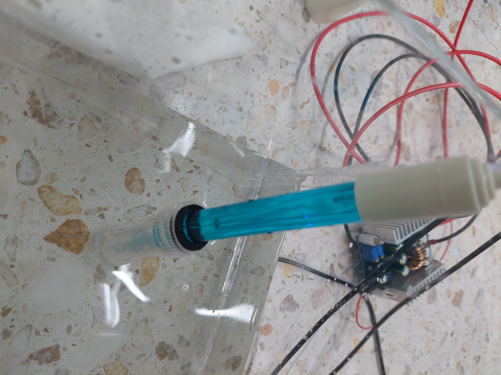 
<p align="center">

* **Controller** <br>
<p align="center">
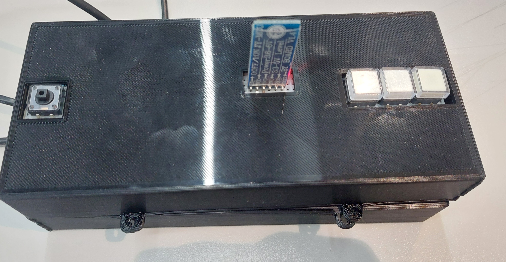 
<p align="center">


* **Water&Nutrient Pum**<br>
<p align="center">
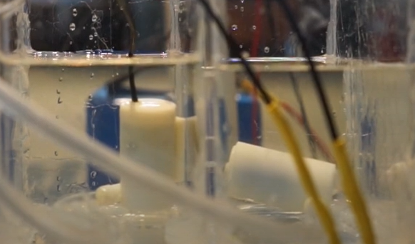 
<p align="center">

___

## Problem 2: ARDUINO (Display & Main pump, Main LED) <br>

The organic light-emitting diode (OLED) display , 2.42-inch display with 128×64 pixels as shown in the following figure.

<p align="center">
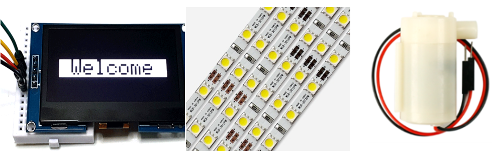 
<p align="center">


### 2-1. Library <br>
1. You need the adafruit_SSD1306.h and the adafruit_GFX.h libraries. 
   * Open your Arduino IDE and go to Sketch > Include Library > Manage Libraries. The Library Manager should open. 
   * Type “SSD1306” in the search box and install the SSD1306 library from Adafruit.

### 2-2. Procedure <br>
1. Create a new project under the directory `\ARDUINO\Project\OLED_Display`
   * The project name is **"OLED_Display".** <br>
2. Include library in your project.
   * **SPI.h**  - Include the SPI library for communication
   * **Wire.h** - Include the Wire library for I2C communication
   * **Adafruit_GFX.h** - Include Adafruit graphics library for OLED
   * **Adafruit_SSD1306.h** - Include Adafruit SSD1306 library for the OLED display
   * **Adafruit_GFX.h** - Include Adafruit graphics library for OLED
   * **SoftwareSerial.h** - Include SoftwareSerial library for serial communication

```c++
#include <SPI.h>               
#include <Wire.h>             
#include <Adafruit_GFX.h>     
#include <Adafruit_SSD1306.h>  
#include <SoftwareSerial.h>    
```
3. First, check that USART6 communication is working properly on the Arduino Uno board, check the serial output.
   * connect to the Arduino Rx pin (0) to NUCLEO F411RE Tx pin (11)
4. Second, you just need to connect to the Arduino Uno I2C pins as shown in Configuration.
   * Connect SDA of OLED display to Pin A4
   * Connect SCL of OLED display to Pin A5
5. Third, you just need to connect water pump and 12V Battery as shown in Circuit Diagram <br>
6. Following figure is block diagram of OLED display procedure <br>

<p align="center">
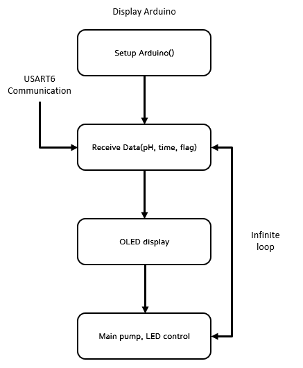 
<p align="center">

___

### 2-3. Configuration <br>

* **OLED & USART 6**

| **Pin** | **Wiring to Arduino Uno** |
|---------|---------------------------|
| Vin     | 5V                        |
| GND     | GND                       |
| SCL     | A5                        |
| SDA	  | A4                        |
| RX      | Pin 0                     |

* **Main Pump & LED Bar**

| **Pin**           | **Wiring to Arduino Uno** |
|-------------------|---------------------------|
| DIR               | Pin 8                     |
| Main Pump and LED | Pin 7                     |
| Vin               | 5V                        |
| GND	            | GND                       |


### 2-4. Circuit Diagram <br>
<p align="center">
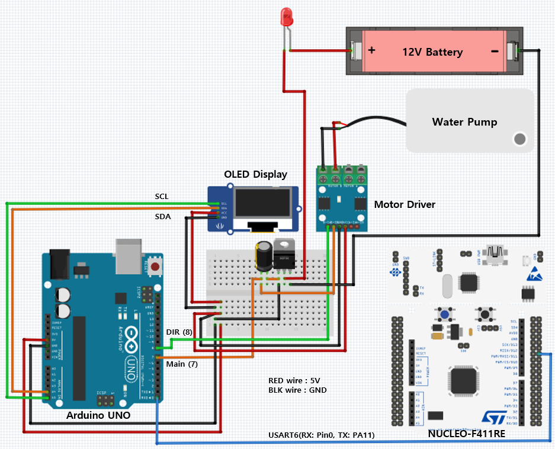 
<p align="center">

___

### 2-5. Discussion <br>
1. How to do serial communication on Arduino? <br>
   * Problem
    > When using pins 0 and 1 for other serial communication purposes, such as connecting to external devices (e.g., sensors, displays, or other microcontrollers), a conflict arises. <br>
      The simultaneous use of these pins for two purposes can lead to:
    >   * **Data Collision**: Both the external device and the computer may attempt to send or receive data simultaneously, causing errors.
    >   * **Debugging Limitations**: When pins 0 and 1 are in use for other communication, debugging through the Serial Monitor becomes unreliable or impossible.
   
   * Solution
    > Use of SoftwareSerial Library. <br>
     To avoid conflicts, the SoftwareSerial library can be used to create additional serial ports on other digital pins. This allows the Arduino to communicate with external devices on pins 2 and 3, while keeping the hardware serial (pins 0 and 1) dedicated to communication with the computer.
    > ```
    > #include <SoftwareSerial.h>
    > mySerial(2, 3); // 2: RX, 3: TX
    > ```   
   
### 2-6. Code <br>
* **header file**<br>
    ```cpp
    #include <SPI.h>              // Include the SPI library for communication
    #include <Wire.h>             // Include the Wire library for I2C communication
    #include <Adafruit_GFX.h>     // Include Adafruit graphics library for OLED
    #include <Adafruit_SSD1306.h> // Include Adafruit SSD1306 library for the OLED display
    #include <SoftwareSerial.h>   // Include SoftwareSerial library for serial communication
    ```
* **set up** <br>
    This code sets up the OLED displayer, receive data via USART6.
    ```cpp
    #define SCREEN_WIDTH 128 // Define the OLED display width in pixels
    #define SCREEN_HEIGHT 64 // Define the OLED display height in pixels
    
    // On an Arduino UNO: A4 (SDA) and A5 (SCL) are used for I2C communication
    #define SCREEN_ADDRESS 0x3C // Define the I2C address of the OLED display (0x3C for 128x64 resolution)
    #define OLED_RESET     -1   // Reset pin # (or -1 if sharing Arduino reset pin)
    Adafruit_SSD1306 display(SCREEN_WIDTH, SCREEN_HEIGHT, &Wire, OLED_RESET); // Create an instance of the OLED display
    
    // Define buffers and variables for the program
    char pHlevel[128]; // Buffer to store incoming serial data
    float pH = 0.0;    // Variable to store pH level
    char tim[16], date[16], dayOfWeek[10]; // Buffers for time, date, and day of the week
    int flag = 0, mode_flag = 0;           // Flags to control pump and mode (manual/auto)
    
    // Define an array of day names for reference
    const char* days[] = {"", "<Mon>", "<Tue>", "<Wed>", "<Thu>", "<Fri>", "<Sat>", "<Sun>"};
    
    void setup() {
      Serial.begin(9600); // Initialize serial communication at 9600 baud
    
      // Set pin modes for output
      pinMode(7, OUTPUT); // Pin 7 controls an LED or main pump
      pinMode(8, OUTPUT); // Pin 8 controls pump direction
      digitalWrite(7, LOW); // Ensure pump is initially off
      digitalWrite(8, LOW); // Ensure pump direction is initially off
    
      // Initialize the OLED display
      if (!display.begin(SSD1306_SWITCHCAPVCC, SCREEN_ADDRESS)) { // Check if the OLED initializes successfully
        Serial.println(F("SSD1306 allocation failed"));           // Print error if initialization fails
        for (;;) ;                                                // Stop execution if OLED initialization fails
      }
    
      // Display initial splash screen
      display.display(); 
      delay(2000); // Pause for 2 seconds
    }
    
    ```

* **OLED display** <br>
    ```c++
    void OLEDdisplay(float pHvalue, const char* time, const char* date, const char* dayOfWeek, int mode_flag, int flag) {
        display.clearDisplay(); // Clear the OLED screen
        display.setTextSize(2); // Set text size to 2x
        display.setTextColor(SSD1306_WHITE); // Set text color to white
        display.setCursor(0, 0);             // Set cursor position at top-left
        display.println(F("SMART FARM"));    // Display a title
        
        // Display mode information
        display.setTextSize(1);
        display.setCursor(0, 20);
        display.print("Mode: ");
        if (mode_flag == 1) { // Check if mode is manual
        display.setCursor(30, 20);
        display.print("MANUAL");
        } else { // Otherwise, display auto
        display.setCursor(30, 20);
        display.print("AUTO");
        }
        
        // Display pump status
        display.setCursor(70, 20);
        display.print("PUMP: ");
        if (flag == 1) { // Check if pump is on
        display.setCursor(110, 20);
        display.print("ON");
        } else { // Otherwise, display off
        display.setCursor(110, 20);
        display.print("OFF");
        }
        
        // Display pH level
        display.setCursor(0, 30);
        display.print("pH level: ");
        display.println(pHvalue, 2);
        
        // Display time
        display.setCursor(0, 40);
        display.print("Time: ");
        display.println(time);
        
        // Display date and day of the week
        display.setCursor(0, 50);
        display.print("Date: ");
        display.print(date);
        display.print(" ");
        display.println(dayOfWeek);
        
        display.display(); // Update the OLED with the new content
    }
    ```

* **getDayOfWeek**<br>
    This function get day of the week based on an integer flag
    ```c++
    void getDayOfWeek(int day) { // Function to get day of the week based on an integer
        if (day >= 1 && day <= 7) strcpy(dayOfWeek, days[day]); // Check if the day is valid
        else strcpy(dayOfWeek, "Unknown"); // Set to "Unknown" for invalid days
    }
    ```
  
* **main loop** <br>
    ```c++
        void loop() {
            if (Serial.available()) { // Check if data is available from the serial input
            // Read incoming data until a newline character or buffer limit
            int len = Serial.readBytesUntil('\n', pHlevel, sizeof(pHlevel) - 1);
            if (len > 0 && len < sizeof(pHlevel)) { // Ensure valid data length
            pHlevel[len] = '\0';                  // Null-terminate the string
            
            // Parse the data separated by commas
            char* token = strtok(pHlevel, ",");
            if (token != NULL) pH = atof(token); // Convert first token to a float (pH level)
            
            token = strtok(NULL, ",");
            if (token != NULL) strncpy(tim, token, sizeof(tim) - 1); // Copy second token to time buffer
            
            token = strtok(NULL, ",");
            if (token != NULL) strncpy(date, token, sizeof(date) - 1); // Copy third token to date buffer
            
            token = strtok(NULL, ",");
            if (token != NULL) flag = atoi(token); // Convert fourth token to integer (pump flag)
            
            token = strtok(NULL, ",");
            if (token != NULL) mode_flag = atoi(token); // Convert fifth token to integer (mode flag)
            
            // Update the OLED display with the parsed data
            OLEDdisplay(pH, tim, date, dayOfWeek, mode_flag, flag);
            
            // Set digital output based on pump flag
            digitalWrite(7, flag ? HIGH : LOW);
        } else Serial.println("Data Error: Buffer Overflow or Invalid Data"); // Print error message for invalid data
    }
    ```

### 2-7. Results <br>
* **OLED display** <br>
<p align="center">
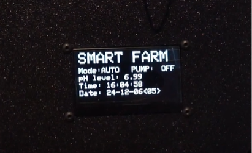 
<p align="center">

* **Main LED** <br>
<p align="center">
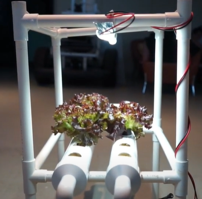 
<p align="center">

* **Main Pump**<br>
<p align="center">
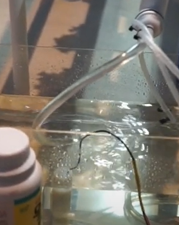 
<p align="center">


* Demo video link <br>
  https://www.youtube.com/watch?v=Pgcpq7QTzDw<br>

